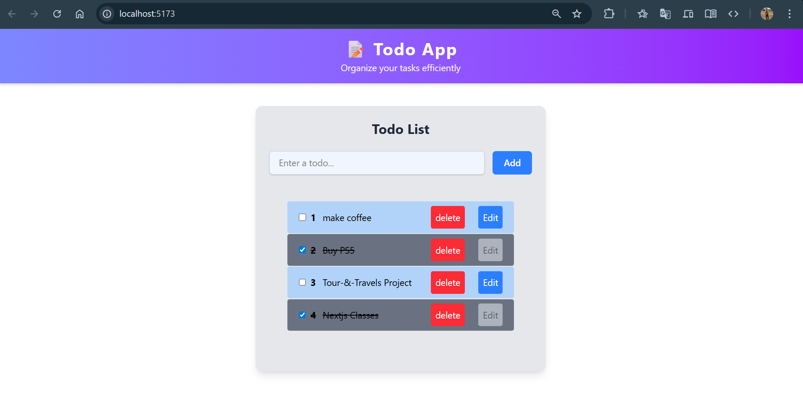
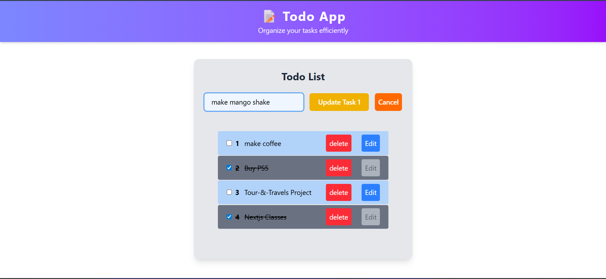

<div align="center">
  
  <h1>Todo App</h1>
  <p>A modern, Todo application built with React, Vite, and Tailwind CSS.</p>
</div>

---

## 🚀 Features

- Add, delete, and update todos
- Mark todos as completed (with persistent state)
- Responsive and minimal design
- Local storage persistence
- Fast development with Vite
- Clean code structure and easy to extend

## 📸 Screenshots





---

## 🛠️ Getting Started

1. **Install dependencies:**
   ```bash
   npm install
   ```
2. **Start the development server:**
   ```bash
   npm run dev
   ```
3. **Open your browser:**
   Visit `http://localhost:5173` (or the port shown in the terminal).

---

## 📁 Project Structure

- `src/components/` — React components (`TodoList`, `TodoItem`, etc.)
- `src/context/` — Context for managing delete logic
- `public/` — Static assets

---

## 🧰 Technologies Used

- [React](https://react.dev/) — UI library
- [Vite](https://vitejs.dev/) — Build tool
- [Tailwind CSS](https://tailwindcss.com/) — Utility-first CSS framework
- [GitHub Repository](https://github.com/NavBst/todo-app)

---

## 📦 Usage

1. Add a todo using the input box and "Add" button.
2. Mark todos as completed by checking the box.
3. Delete or update todos using the respective buttons.
4. All changes are saved in your browser's local storage.

---

## 🤝 Contributing

Contributions, issues, and feature requests are welcome! Feel free to check the [issues page](https://github.com/NavBst/todo-app/issues) or submit a pull request.

---


